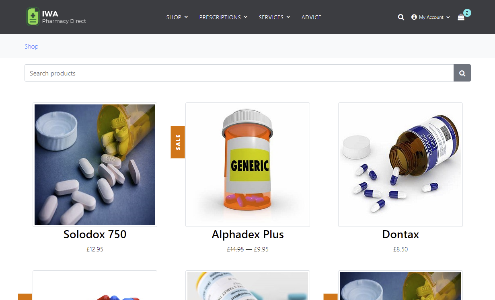

[](https://github.com/fortify/IWA-DotNet/actions/workflows/fortify.yml)

# IWA.NET (Insecure Web App) Pharmacy Direct

#### Table of Contents

*   [Overview](#overview)
*   [Forking the Repository](#forking-the-repository)
*   [Pre-Requisites](#pre-requisites)
*   [Building the Application](#building-the-application)
*   [Running the Application](#running-the-application)
*   [Application Security Testing Integrations](#application-security-testing-integrations)
    * [SAST using Fortify Static Code Analyzer command line](#static-analysis-using-fortify-static-code-analyzer-command-line)
    * [SAST using Fortify ScanCentral SAST](#static-analysis-using-fortify-scancentral-sast)
    * [SAST using Fortify on Demand](#static-analysis-using-fortify-on-demand)
    * [DAST using Fortify WebInspect](#dynamic-analysis-using-fortify-webinspect)
    * [DAST using Fortify ScanCentral DAST](#dynamic-analysis-using-fortify-scancentral-dast)
    * [DAST using Fortify on Demand](#dynamic-analysis-using-fortify-on-demand)
    * [API Security Testing using Fortify WebInspect and Postman](#api-security-testing-using-fortify-webinspect-and-postman)
    * [API Security Testing using ScanCentral DAST](#api-security-testing-using-scancentral-dast-and-postman)
*   [Build and Pipeline Integrations](#build-and-pipeline-integrations)
    * [GitHub Actions](#github-actions)
    * [Azure DevOps Pipeline](#azure-devops-pipelines)
*   [Developing and Contributing](#developing-and-contributing)
*   [Licensing](#licensing)

## Overview

_IWA.NET (Insecure Web App) Pharmacy Direct_ is an example Microsoft.NET Core Web Application for use in **DevSecOps** scenarios and demonstrations.
It includes some examples of bad and insecure code - which can be found using static and dynamic application
security testing tools such as [OpenText Fortify](https://www.opentext.com/en-gb/products/application-security).

One of the main aims of this project is to illustrate how security can be embedded early ("Shift-Left") and continuously ("CI/CD") in
the development lifecycle. Therefore, a number of examples of "integrations" to common CI/CD pipeline tools are provided.

The application is intended to provide the functionality of a typical "online pharmacy", including purchasing Products (medication)
and requesting Services (prescriptions, health checks etc). It has a modern-ish HTML front end (with some JavaScript) and a Swagger based API.

*Please note: the application should not be used in a production environment!*



## Forking the Repository

In order to execute example scenarios for yourself it is recommended that you "fork" a copy of this repository into
your own GitHub account. The process of "forking" is described in detail in the 
[GitHub documentation](https://docs.github.com/en/github/getting-started-with-github/fork-a-repo) - you can start the process 
by clicking on the "Fork" button at the top right.

## Pre-Requisites

 - Microsoft .NET 6.0.x SDK
 - Visual Studio 2022 Community Edition (or higher)
 - (Optional) SQL Server Express 2019 including SQL Server LocalDB
 - (Optional) [Fortify Static Code Analyzer](https://www.opentext.com/en-gb/products/fortify-static-code-analyzer) local install
 - (Optional) [Fortify command line (fcli) tool](https://github.com/fortify/fcli)
 - (Optional) [Debricked CLI](https://docs.debricked.com/tools-and-integrations/cli/debricked-cli)

## Building the Application

To build the application, select `Build->Build Solution` from within Visual Studio or
carry out the following from a command prompt:

```Cmd
cd InsecureWebApp
dotnet restore
dotnet build
```

To create a Docker image build the application as above and then carry out the following:

```Cmd
docker build --tag iwa.net --file Dockerfile .
```

## Running the Application

To run the application, click on the "Run/Play" button in Visual Studio (with the `IWA` profile selected) 
or carry out the following from a 
command prompt:

```Cmd
dotnet run
```

To run a Docker container using the image built above you can use:

```Cmd
docker run -d -p 5001:80 iwa.net
```

Whichever mechanism you use, the application should be available in your browser at `https://localhost:5001/`

## Application Security Testing Integrations

### SAST using Fortify Static Code Analyzer command line

There is an example batch script that you can use to execute static application security testing
via [Fortify Static Code Analyzer](https://www.opentext.com/en-gb/products/fortify-static-code-analyzer).

```Cmd
FortifyScanCommands.bat
```

or you can directly run the following commands:

```Cmd
sourceanalyzer -b iwa -clean
sourceanalyzer -b iwa -debug -logfile trans.log dotnet build IWA.NET.sln
sourceanalyzer -b iwa -debug -logfile scan.log -scan -f IWA.fpr
start "" "IWA.fpr"
```

This script runs a "sourceanalyzer" translation and scan on the project's source code. 
It creates a Fortify Project Results file called `IWA.fpr` which you can open using the 
Fortify `auditworkbench` tool:

```Cmd
auditworkbench IWA.fpr
```

### SAST using Fortify ScanCentral SAST

TBD

### SAST using Fortify on Demand

To execute a [Fortify on Demand](https://www.microfocus.com/en-us/products/application-security-testing/overview) 
SAST scan you need to package and upload the source code to Fortify on Demand. 
To package the code into a Zip file for uploading you can use the `scancentral` command utility as following:

```Cmd
"C:\Program Files\Microsoft Visual Studio\2022\Enterprise\Common7\Tools\VsDevCmd.bat"
scancentral package --build-tool msbuild --build-file IWA.NET.sln --output fod.zip
```

You can then upload this manually using the Fortify on Demand UI or alternately you can use the 
Fortify fcli tool to upload this Zip file and start a scan using the following:

```Cmd
fcli fod session login --url https://api.ams.fortify.com --client-id __FOD_CLIENT_ID_ --client-secret _FOD_CLIENT_SECRET__
fcli fod sast-scan start --release _YOUR_APP_:_YOUR_REL_ -f fod.zip --store curScan
fcli fod sast-scan wait-for ::curScan::
``` 

where `_FOD_CLIENT_ID_` and `_FOD_CLIENT_SECRET_` are the values of an API Key and Secret you have created in the Fortify on
Demand portal, and `_YOUR_APP_` and `_YOUR_REL_` is the Fortify on Demand Application and Release name you are running the scan for.

### DAST using Fortify WebInspect

To carry out a WebInspect scan you should first "run" the application using one of the steps described above.
Then you can start a scan using the following command line:

```
"C:\Program Files\Fortify\Fortify WebInspect\WI.exe" -s ".\etc\IWA-UI-Dev-Settings.xml" -macro ".\etc\IWA-UI-Dev-Login.webmacro" -u "https://localhost:5001" -ep ".\IWA.NET-DAST.fpr" -ps 1008
```

This will start a scan using the Default Settings and Login Macro files provided in the `etc` directory. It assumes
the application is running on "https://localhost:5001". It will run a "Critical and High Priority" scan using the policy with id 1008. 
Once completed you can open the WebInspect "Desktop Client" and navigate to the scan created for this execution. An FPR file
called `IWA.NET-DAST.fpr` will also be available - you can open it with `auditworkbench` (or generate a
PDF report from using `ReportGenerator`). You could also upload it to Fortify SSC or Fortify on Demand.

### DAST using Fortify ScanCentral DAST

TBD

### DAST using Fortify on Demand

TBD

### API Security Testing using Fortify WebInspect and Postman

TBD

### API Security Testing using ScanCentral DAST

TBD

### OSS Software Composition Analysis using Debricked

To carry out a Debricked scan using the [Debricked CLI](https://docs.debricked.com/tools-and-integrations/cli/debricked-cli) carry out the following from a command prompt:

```Cmd
cd InsecureWebApp
debricked scan . -e "*\**.lock" -e "**\node_modules\**" -r _DEBRICKED_REPO_ -t _DEBRICKED_TOKEN_
```

where `_DEBRICKED_REPO_` is the name of the repository you want represented in Debricked UI and 
`_DEBRICKED_TOKEN_` is your Debricked [access token](https://docs.debricked.com/product/administration/generate-access-token).

## Build and Pipeline Integrations

### GitHub Actions

There is a simple GitHub action [fortify.yml](.github\workflows\fortify.yml) for carrying out a
SAST scan using Fortify on Demand.

### Azure DevOps Pipeline

An Azure Devops pipeline [azure-pipelines.yml](azure-pipelines.yml) is provided and has variables such as "USE_FOD_SAST" 
or "USE_SCANCENTRAL_DAST" which can be set to True or False depending on which application security testing integration you require.

## Licensing

This application is made available under the [GNU General Public License V3](LICENSE)